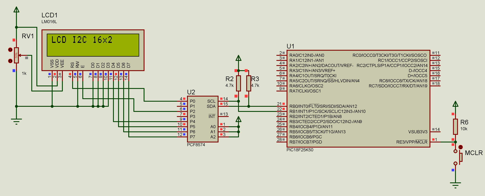

# Display LCD I2C com PIC18F25K50

Este projeto implementa um sistema de display LCD utilizando o HD44780 com módulo I2C PCF8574 e um microcontrolador PIC18F25K50. O sistema fornece uma interface simples para exibição de texto em displays LCD através de comunicação I2C.



## 🚀 Características

- Comunicação I2C a 100kHz
- Suporte para displays LCD 16x2 e 20x4
- Modo de interface 4 bits
- Controle de backlight
- Posicionamento e controle do cursor
- Funções para exibição de strings e caracteres
- Biblioteca de funções de fácil utilização

## 📋 Pré-requisitos

### Software
- mikroC PRO for PIC v7.6.0 (edição, compilação e depuração)
- Proteus v8.16 (para simulação)

### Hardware Necessário
- PIC18F25K50
- Display LCD HD44780 com módulo I2C PCF8574
- Fonte de alimentação 5V
- Resistores pull-up para I2C (4.7kΩ)

## 🔧 Conexões

### Pinagem do PIC18F25K50:
- RB0 (SDA) -> SDA do LCD I2C
- RB1 (SCL) -> SCL do LCD I2C
- VDD -> 5V
- VSS -> GND

### Módulo LCD I2C:
- SDA -> SDA do PIC
- SCL -> SCL do PIC
- VDD -> 5V
- GND -> GND
- Endereço I2C padrão: 0x4E

## 📁 Estrutura do Projeto

```
LCD-I2C-PIC18F25K50/
├── src/
│   ├── main.c
│   ├── LCD_I2C_With_PIC18F25K50.hex
│   ├── LCD_I2C_With_PIC18F25K50.cfg
│   ├── LCD_I2C_With_PIC18F25K50.mcppi
│   └── bibis/
│       ├── lcd_i2c.c
│       └── lcd_i2c.h
├── img/
│   └── circuit.png
├── simulation/
│   └── LCD_I2C_With_PIC18F25K50.pdsprj
├── doc/
│   ├── manual_mikroC-v101.pdf
│   ├── datasheet_HD44780.pdf
│   ├── datasheet_PCF8574.pdf
│   └── datasheet_pic18f25k50.pdf
├── .gitignore
├── license.md
└── readme.md
```

## 🛠️ Compilação e Simulação

1. Clone o repositório:
```bash
git clone https://github.com/genlicos/LCD-I2C-With-PIC18F25K50.git
```

2. Abra o arquivo `src/LCD_I2C_With_PIC18F25K50.mcppi` no mikroC PRO for PIC v7.6

3. Compile o projeto:
   - Faça as devidas modificações de sua preferência
   - Build o projeto (Ctrl+F9)
   - Firmware gerado `src/LCD_I2C_With_PIC18F25K50.hex`

4. Para simulação:
   - Abra o arquivo `simulation/LCD_I2C_With_PIC18F25K50.pdsprj` no Proteus
   - Execute a simulação

## 📄 Configuração Inicial

O código já vem com uma configuração inicial que pode ser modificada alterando os valores no arquivo `src/main.c`:

```c
// Inicialização do sistema
void inicializar_sistema() {
    // Inicializa comunicação I2C
    I2C1_Init(100000);
    delay_ms(100);

    // Inicializa LCD
    I2C_LCD_Init();
}
```

## ⚡ Características Técnicas

1. **Comunicação I2C**
   - Velocidade: 100kHz
   - Resistores pull-up: 4.7kΩ
   - Endereço do LCD: 0x4E

2. **Display LCD**
   - Interface I2C via PCF8574
   - Suporte para 16x2 ou 20x4 caracteres
   - Modo de interface 4 bits
   - Controle de backlight
   - Posicionamento do cursor
   - Funções para caracteres e strings

## 🌡️ Funcionamento

1. Na inicialização:
   - Configura comunicação I2C
   - Inicializa LCD no modo 4 bits
   - Configura parâmetros de operação
   
2. Em operação:
   - Permite escrita de caracteres e strings
   - Controle de posicionamento do cursor
   - Funções para limpar display e retornar cursor
   - Controle de backlight

## 🤝 Contribuindo

1. Faça um Fork do projeto
2. Crie uma Branch para sua modificação (`git checkout -b feature/AmazingFeature`)
3. Commit suas mudanças (`git commit -m 'Add some AmazingFeature'`)
4. Push para a Branch (`git push origin feature/AmazingFeature`)
5. Abra um Pull Request

## 📝 Licença

Este projeto está sob a licença MIT - veja o arquivo [LICENSE](license) para detalhes

## ✒️ Autor

* **Elison Nogueira** - *Trabalho Inicial* - [genlicos](https://github.com/genlicos)

## 🎁 Expressões de gratidão

* Compartilhe este projeto 📢
* Me Convide para uma cerveja 🍺 
* Um agradecimento publicamente 🤝